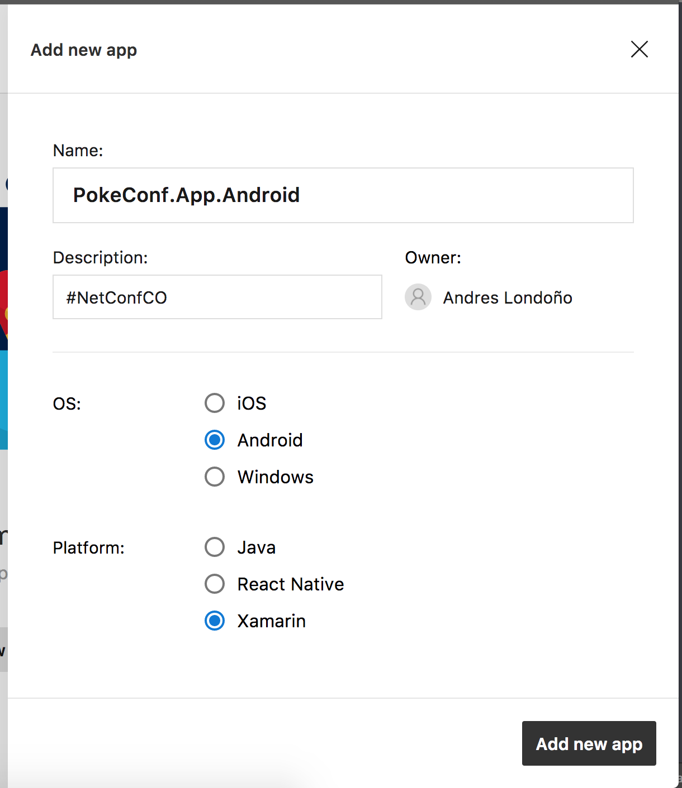
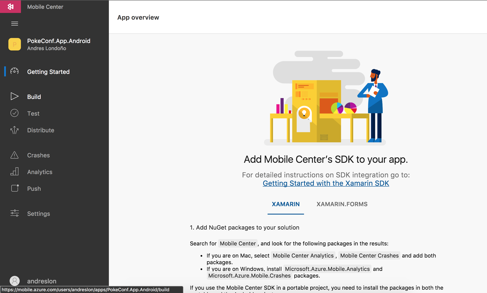
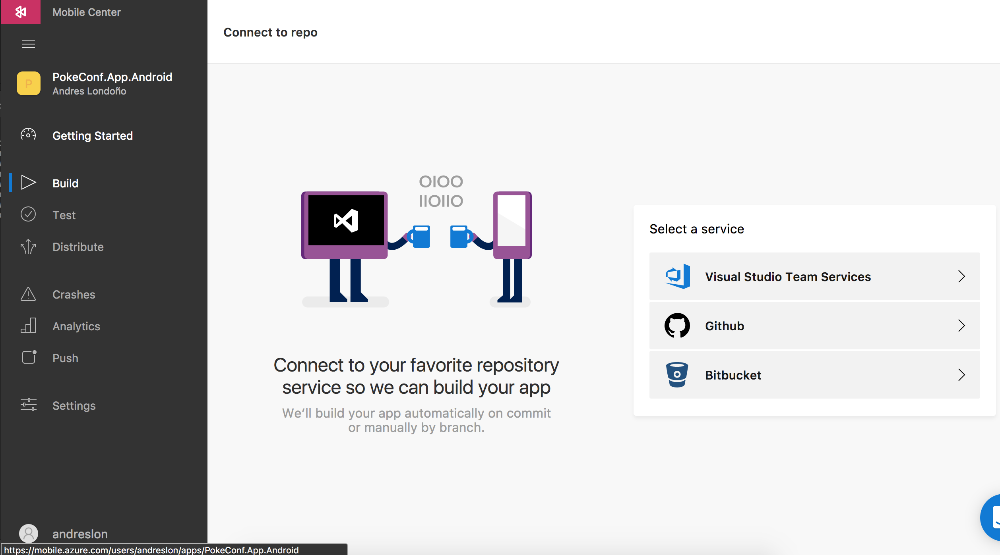
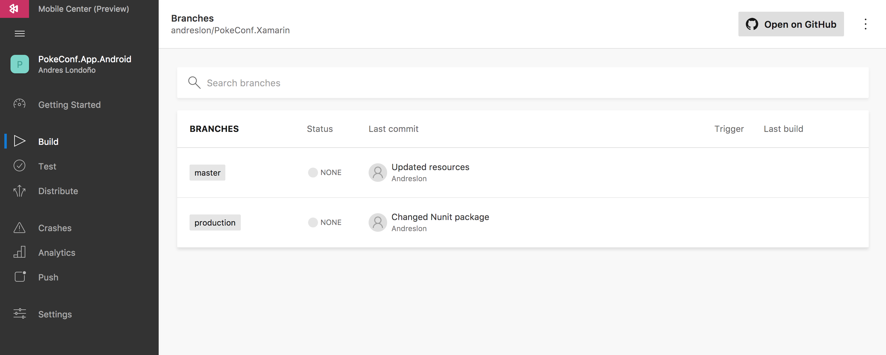
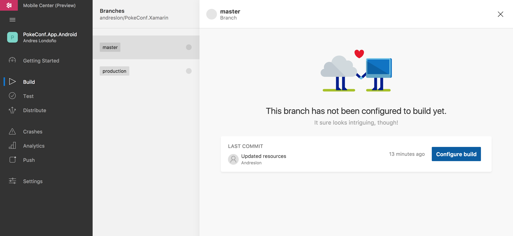
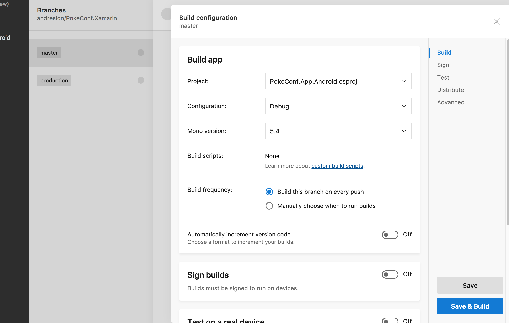
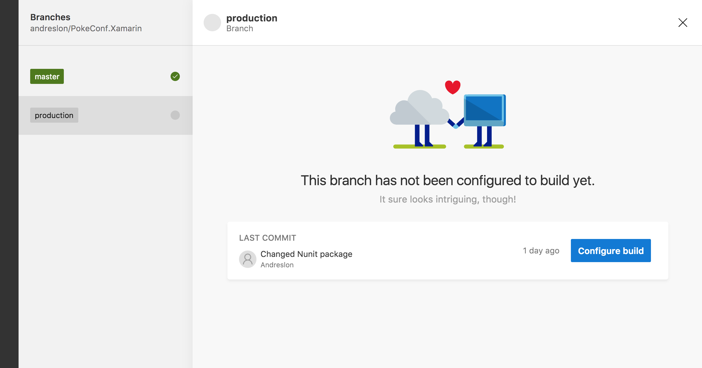
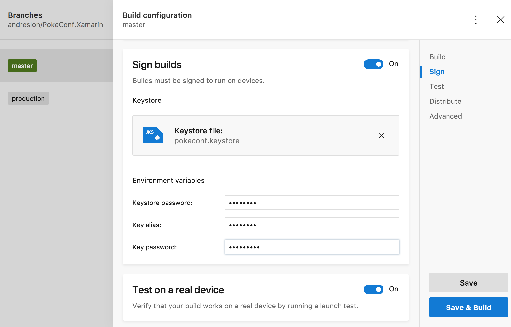
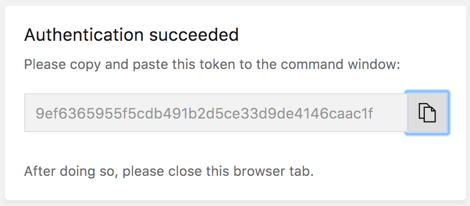

# PokeConf.Xamarin

Este aplicativo fue realizado para el taller del NetConf Colombia 2017, construido en Xamarin Forms y estructurado para el primer acercamiento a DevOps.

## Objetivo

DevOps es una metodologia para la creación de software que se basa en un cambio cultural para su implementación, este cambio cultural va desde la colaboración, la comunicacion y la total integración entre las areas de desarrollo y sistemas (Infraestructura).

Para este laboratorio se ha construido un aplicativo movil llamado PokeConf el cual seguira creciendo según necesidades del mercado, por lo que los desarrolladores deberan establecer un esquema de entrega continua agil mediante herramientas de DevOps, en nuestro caso, se utilizara la plataforma de mobile center, encargada de gestionar, probar y distribuir nuestro aplicativo movil realizado en Xamarin.

# Mobile Center

Mobile center es una plataforma creada por Microsoft que actualmente es gratis, la cual permite gestionar el desarrollo de nuestros aplicativos moviles android, ios y Windows bajo el esquema de DevOps, contando con compilación, pruebas, distribución y métricas.

### Configuración
1. Para comenzar es necesario disponer de una cuenta en [Github](https://www.github.com).

1. Abre el repositorio donde se encuentra alojado el aplicativo prueba [Pokeconf](https://github.com/andreslon/PokeConf.Xamarin.git) y dale 
"fork" para clonarlo a tu cuenta github.

1. Descarga el proyecto desde tu repositorio, abrelo y recompila para restaurar los paquetes, más adelante lo necesitaremos.

1. Abre en el navegador la plataforma [Mobile Center](https://mobile.azure.com) e inicia sesión con la cuenta Github.

1. Al loguearse correctamente, podremos darle click al boton "Add new App" para crear nuestra aplicación.
**Nota**: Se requiere crear una aplicación por cada plataforma (Android, iOS y Windows)

1. Ingresamos los datos de la aplicación, es nuestro caso este lab será bajo el sistema operativo Android y la plataforma Xamarin.

1. Ya podemos previsualizar nuestro panel general.


### Compilación (Build)

1. En el panel izquierdo ingresa a la opción **"Build"**, luego selecciona **Github** como ek servicio de repositorio a utilizar.

1. El sistema se vinculará con la cuenta **Github**, luego selecciona el repositorio "Pokeconf.Xamarin" el cual fue clonado anteriormente a tu cuenta.

1. Posteriormente podras ver las ramas













## Pruebas UI

En el proceso de DevOps uno de los pasos más importantes que asegura la calidad del producto y seguridad a cliente, son las pruebas de la aplicación en entornos reales, como sabemos existen miles variaciones de dispositivos, según marca, versión sistema operativo y caracteristicas.

A continuación realizaremos las configuraciones necesarias y ejecutaremos el código de pruebas de interfaz escritos con anterioridad.

1. Instalar Node.js, version 6.3 o superior
1. Abrir una terminal.
1. Instalar el paquete npm mobile-center-cli con el comando: 
```
npm install -g mobile-center-cli
```
1. Es necesario loguearnos en la terminal con el comando: 
```
mobile-center login
```
Nos abrira el navegador indicando un codigo para pegar en la consola y autorizar la autenticació.


1. Por ultimo procedemos a ejecutar las pruebas de interfaz, con la configuración de dispositivos configurados.
```
mobile-center test run uitest --app "andreslon/PokeConf.App.Android" --devices "andreslon/dev1" --app-path /Users/d_p/Documents/GIT/PokeConf.Xamarin/builds/com.PokeConf.App.apk  --test-series "master" --locale "es_MX" --build-dir /Users/d_p/Documents/GIT/PokeConf.Xamarin/src/PokeConf/PokeConf.App/PokeConf.App.UITests/bin/debug
```


## Contribución
 
Andrés Londoño - Software architect and MVP Microsoft[@Andreslon](https://twitter.com/andreslon).
 
# Comunidad Xamarin Medellin


[Únete a la comunidad](https://www.meetup.com/es-ES/Xamarin-Medellin/)
